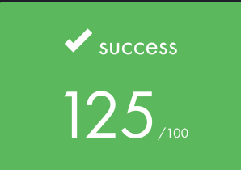

# Push Swap - 42 School Project - 1337 KH

## Overview

Push Swap is a sorting algorithm project that involves sorting a stack of integers using a limited set of operations. The goal is to sort the integers in **Stack A** in ascending order using the fewest number of operations possible. This project is part of the **42 School curriculum**, focusing on **algorithm design**, **optimization**, and **data structure manipulation**.

The project consists of two programs:
1. **push_swap**: Sorts a stack of integers and outputs the sequence of operations.
2. **checker**: Verifies if the sequence of operations generated by `push_swap` correctly sorts the stack.

---

## Screenshots

Here are some screenshots of my project implementation:



---

## Features

- Sorts a stack of integers using a limited set of operations.
- Supports sorting for both small and large datasets.
- Includes a **checker** program to validate the sorting sequence.
- Optimized for performance with minimal operations.
- Handles edge cases such as duplicate values and non-integer inputs.

---

## How It Works

The program uses two stacks, **Stack A** and **Stack B**, and a set of operations to manipulate the stacks. The goal is to sort the integers in **Stack A** using the allowed operations.

### Allowed Operations:
- **sa** : Swap the first two elements of Stack A.
- **sb** : Swap the first two elements of Stack B.
- **ss** : Perform **sa** and **sb** simultaneously.
- **pa** : Push the first element of Stack B to Stack A.
- **pb** : Push the first element of Stack A to Stack B.
- **ra** : Rotate Stack A (shift all elements up by one, the first element becomes the last).
- **rb** : Rotate Stack B (shift all elements up by one, the first element becomes the last).
- **rr** : Perform **ra** and **rb** simultaneously.
- **rra**: Reverse rotate Stack A (shift all elements down by one, the last element becomes the first).
- **rrb**: Reverse rotate Stack B (shift all elements down by one, the last element becomes the first).
- **rrr**: Perform **rra** and **rrb** simultaneously.

---


## Installation

1. Clone the repository:

```bash
   git clone https://github.com/oussama-fa/push_swap_42.git
   cd push_swap_42
```

2. Compile the program:

If you wan't push_swap program:

```bash
    make
```
If you wan't checker program:
```bash
    make bonus
```

3. Run the program:

To sort a list of integers, pass them as arguments to the `push_swap` executable:
```bash
    ./push_swap 3 1 4 2 5
```
## How to Use ./checker
The checker program verifies if the operations generated by push_swap correctly sort the stack. To use it:
```bash
    ./push_swap 3 1 4 2 5 | ./checker 3 1 4 2 5
```
If the stack is sorted, the output will be:
```bash
OK
```
Otherwise, it will display:
```bash
KO
```


